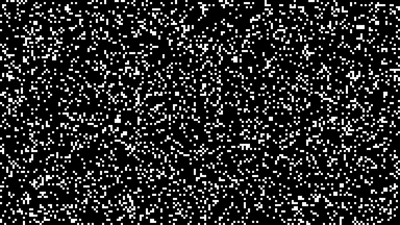

# <p align="center"> 🧬 Game of Life 🧬 </p>
---

This project is a representation of Conway's Game of Life algorithm, made with PyGame and OOP best practices.
To learn more about Game Of Life, visit the [game's Wikipedia](https://pt.wikipedia.org/wiki/Jogo_da_vida).

<br>
<p align="center">
  
</p>

<br>

<p align="center">  

<br>
<br>

## 🎮 Run the Game

First, clone the project:

```> git clone git@github.com:matdomis/game-of-life.git ```

Second, let's install some requirements:

```> cd game-of-life ```

```> pip install -r requirements.txt ```

Now the fun part:

```> python3 game.py ```

## ⌨️ Controls

| Key         | Action                      |
|-------------|-----------------------------|
| `F10`       | Reset the grid              |
| `F11`       | Toggle fullscreen           |
| `+ / -`     | Increase/decrease spawn rate |
| `ESC`       | Quit the game               |